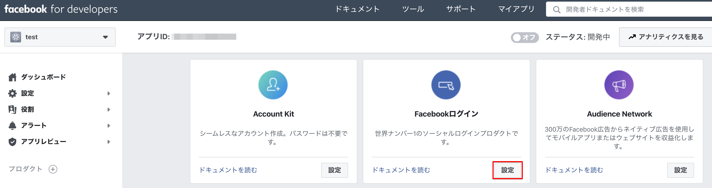
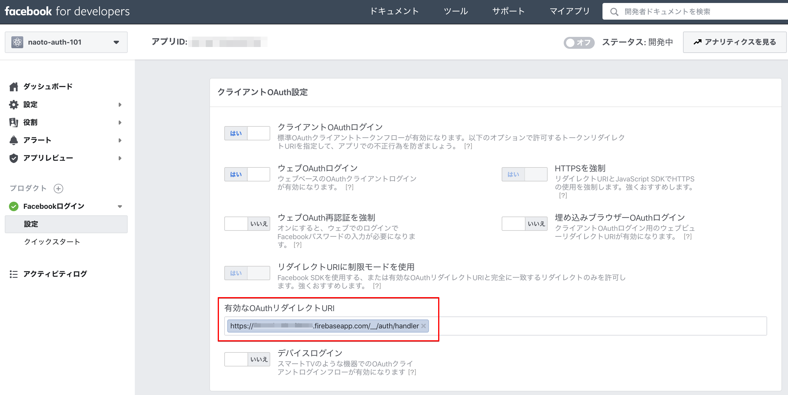

# GCP-typescript-react-golang-mongodb-101

## 1. Setup gcloud

At first, install `gcloud` command (Google Cloud SDK) on your local PC.
[Using the Google Cloud SDK installer](https://cloud.google.com/sdk/docs/downloads-interactive)

After that, execute the following commands.

```bash
# setup your environment on local
sudo gcloud components update
sudo gcloud components install app-engine-go

# Autheticate your acount
gcloud auth login
```

## How to write a `app.yaml` file

[app.yaml Configuration File](https://cloud.google.com/appengine/docs/standard/go/config/appref)

## 2. Deploy Golang app (Backend) to Google App Engine (GCP)

[Quickstart for Go 1.12+ in the App Engine Standard Environment](https://cloud.google.com/appengine/docs/standard/go/quickstart)

```bash
# setup your environment on local
sudo gcloud components update

# create the project for golang
gcloud projects create gcp-golang-101 --set-as-default
gcloud projects describe gcp-golang-101

# create Google App Engine
gcloud app create --project=gcp-golang-101
-> select [2] asia-northeast1 (Tokyo region)

# deploy
gcloud app deploy server/app-local.yaml --project gcp-golang-101
```

You may need to enable Cloud Build API for this GCP project.

## 3. Deploy React app (Frontend) to Google App Engine (GCP)

[Quickstart for Node.js in the App Engine Standard Environment](https://cloud.google.com/appengine/docs/standard/nodejs/quickstart)

```bash
# setup your environment on local
sudo gcloud components update

# create the project for golang
gcloud projects create gcp-react-101 --set-as-default
gcloud projects describe gcp-react-101

# create Google App Engine
gcloud app create --project=gcp-react-101
-> select [2] asia-northeast1 (Tokyo region)

# deploy
gcloud app deploy client/app.yaml --project gcp-react-101
```

## 4. Setup Cloud Build on GCP

At first, setup a Cloud Build GitHub App that allows you to automatically build your code each time you push a new commit to GitHub.

[Cloud Build GitHub App](https://github.com/marketplace/google-cloud-build)

After that, follow the next step.

[Running builds on GitHub](https://cloud.google.com/cloud-build/docs/run-builds-on-github)

[Creating a basic build configuration file](https://cloud.google.com/cloud-build/docs/configuring-builds/create-basic-configuration)

```bash
Step #2: ERROR: (gcloud.app.deploy) Permissions error fetching application [apps/gcp-react-101]. Please make sure you are using the correct project ID and that you have permission to view applications on the project.
```

- Go to the Google Cloud Console -> IAM & admin -> IAM.
- Locate the service account and click the pencil icon.
- Add the role "App Engine Admin" to the service account.
- Add **the same member**


[gcloud - ERROR: (gcloud.app.deploy) Permissions error fetching application](https://stackoverflow.com/questions/56126481/gcloud-error-gcloud-app-deploy-permissions-error-fetching-application)

## 5. Firebase Auth

### 5.1. Get credential data (apikey, etc...)

1. log in Firebase and then open the project page.
2. click [add an app] on [abstract] page.
3. select [add Firebase to webapp].
4. Copy the snippet to an app.

[設定ファイルをダウンロードする](https://support.google.com/firebase/answer/7015592)
[Firebase を JavaScript プロジェクトに追加する](https://firebase.google.com/docs/web/setup?hl=ja)
[JavaScript で Facebook ログインを使用して認証する](https://firebase.google.com/docs/auth/web/facebook-login?hl=ja)

[How to add environmental variables to Google App Engine (node.js) using Cloud Build](https://medium.com/@brian.young.pro/how-to-add-environmental-variables-to-google-app-engine-node-js-using-cloud-build-5ce31ee63d7)








